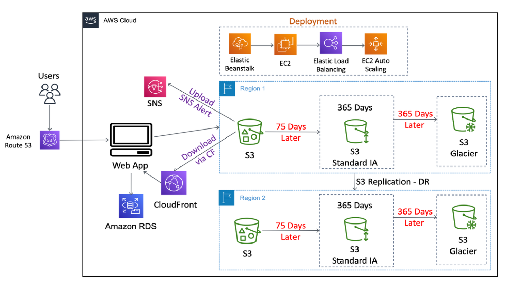

# EzCloudStore

## Overview

**EzCloudStore** is a cloud-based file storage and sharing platform that enables users to upload, manage, and share files securely. Built using Java and Spring Boot, the application leverages AWS services to ensure scalability, reliability, and performance.

**Project Link:** [www.ezcloudstore.com](http://www.ezcloudstore.com)

## Table of Contents
- [Demo Video](#demo-video)
- [Features](#features)
- [AWS Architecture](#aws-architecture)
- [Tools & Technologies](#tools--technologies)
- [Skills](#skills)
- [Getting Started](#getting-started)
- [Installation](#installation)
- [Usage](#usage)
- [API Endpoints](#api-endpoints)
- [License](#license)


## Demo Video

Check out this short video demonstration to see EzCloudStore application in action:

[](https://youtu.be/JROeVGt9_dg)

## Features

- Secure user authentication with OAuth2 (Google Sign-In)
- File upload and management system with AWS S3
- Multi-tenancy support for isolated user data
- Scalable architecture using AWS Elastic Beanstalk
- Automatic file transfer acceleration with S3 Transfer Acceleration
- Real-time notifications using AWS Simple Notification Service (SNS)
- Responsive front-end interface built with JSP

## AWS Architecture

The application is deployed on AWS using the following architecture:



## Tools & Technologies

This section outlines the tools and technologies used in the EzCloudStore project:

### Programming Languages & Frameworks

- **Java**
- **Spring Boot**
- **Spring MVC**
- **Java Server Pages (JSP)**
- **JavaScript**
- **HTML & CSS**

### Backend Development

- **Spring Data JPA** (for database access)
- **REST API** (for client-server communication)
- **AWS SDK for Java** (for interaction with AWS services)
- **Apache Maven** (for dependency management and build)

### Frontend Development

- **HTML, CSS, JavaScript** (for the user interface)
- **Java Server Pages (JSP)** (for dynamic views)

### Amazon Web Services (AWS)

- **AWS Elastic Beanstalk** (for application deployment)
- **AWS CloudFront** (for content delivery and caching)
- **Amazon EC2** (instances for compute capacity)
- **Amazon S3** (for file storage)
- **Amazon S3 Transfer Acceleration** (for fast file transfers)
- **Amazon S3 Lifecycle Policies** (for cost-effective storage management)
- **Amazon RDS** (for MySQL database management)
- **Amazon VPC** (for inbound and outbound traffic control)
- **Application Load Balancer** (for HTTP and HTTPS traffic)
- **Auto Scaling** (for dynamic resource allocation)
- **AWS Route 53** (for Domain Name System (DNS) management)
- **AWS SNS** (for real-time notifications)
- **Cross-Region Replication** (for disaster recovery)

### Authentication & Security

- **OAuth2 (Google Sign-In)** (for authentication)
- **AWS IAM** (for role-based access control)
- **S3 Bucket Policies** (for data security and access control)
- **S3 Versioning** (for data protection)

### Database

- **MySQL** (managed by **Amazon RDS**)
- **Spring Data JPA** (for managing data persistence)

### Deployment & Infrastructure

- **Elastic Beanstalk** (automated deployment)
- **Auto Scaling** and **ELB** (for high availability)
- **Multi-AZ Deployment** (for fault tolerance in **RDS**)
- **Cross-Region Replication** (for disaster recovery)

### Monitoring & Alerting

- **AWS CloudWatch** (for metrics and alarms)
- **SNS** (to trigger alerts)

### IDE & Development Tools

- **IntelliJ IDEA** (for Java development)
- **Apache Tomcat** (embedded server)
- **GitHub** (for source control)

## Skills

This section highlights the skills leveraged in the EzCloudStore project:

- **Cloud Computing**: AWS Architecture & Management, Infrastructure as Code, Disaster Recovery Planning
- **Backend Development**: Java & Spring Boot, Spring MVC, Data Persistence with Spring Data JPA
- **Frontend Development**: HTML, CSS, JavaScript, JSP for dynamic web page rendering
- **Security**: User Authentication & Authorization, Access Control, Multi-Tenancy Security
- **Deployment & Automation**: Auto Scaling & Load Balancing, CloudFront & S3 Transfer Acceleration
- **Scalability & Performance Optimization**: Auto Scaling, S3 Lifecycle Rules, Route 53 & CloudFront
- **Database Management**: MySQL Database Design, CRUD operations with Spring Data JPA
- **Monitoring & Fault Tolerance**: CloudWatch monitoring, Cross-Region Replication, ELB & Multi-AZ RDS
- **User Interaction & Notifications**: SNS for real-time alerts, OAuth2 for streamlined user onboarding
- **Project Management**: MVC Architecture, Agile Methodologies

## Getting Started

Follow these instructions to set up the project locally.

### Prerequisites

- Java 11 or higher
- Maven
- AWS account for hosting services
- MySQL installed or access to Amazon RDS

### Installation

1. Clone the repository:
   ```bash
   git clone https://github.com/rohanbhadreshpatel/ezcloudstore.git
   cd ezcloudstore
   ```

2. Configure your AWS credentials:
   - Set up an IAM user with the necessary permissions to access S3, RDS, and other services.
   - Add your AWS credentials to your local environment variables.

3. Create a MySQL database:
   - Create a new database in your MySQL instance or Amazon RDS.
   - Update the `application.properties` file with your database connection details.

4. Build the project using Maven:
   ```bash
   mvn clean install
   ```

5. Run the application:
   ```bash
   mvn spring-boot:run
   ```

## Usage

Once the application is running, you can access the user interface at `http://localhost:8080`. Users can sign up, log in, and start uploading files.

### API Endpoints

| Endpoint                    | Method  | Description                              |
|-----------------------------|---------|------------------------------------------|
| `/`                         | GET     | Redirect to the registration page        |
| `/register`                 | GET     | Display the registration page            |
| `/login`                    | GET     | Display the login page                   |
| `/dashboard`                | GET     | Display the user dashboard               |
| `/adminlogin`               | GET     | Display the admin login page             |
| `/admindashboard`           | GET     | Display the admin dashboard              |
| `/googleLogin`              | GET     | Initiate Google login process            |
| `/registerUser`             | POST    | Register a new user                      |
| `/loginUser`                | POST    | Authenticate and log in a user           |
| `/loginWithGoogle`          | POST    | Log in a user using Google authentication|
| `/uploadFile`               | POST    | Upload a file to the user's storage      |
| `/downloadFile`             | GET     | Download a file                          |
| `/delete`                   | POST    | Delete a user's file                     |
| `/checkadmin`               | POST    | Authenticate and log in an admin         |
| `/admindelete`              | POST    | Allow an admin to delete a user's file   |
| `/logout`                   | POST    | Log out the current user                 |

## License

This project is licensed under the MIT License - see the [LICENSE](LICENSE) file for details.